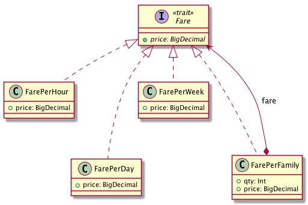

# Rental bikes exercise

[](https://travis-ci.org/LeonhardtDavid/rental-bikes)
[](https://coveralls.io/github/LeonhardtDavid/rental-bikes)
[](http://www.apache.org/licenses/LICENSE-2.0.txt)

## Context

A company rents bikes under following options:

1. Rental by hour, charging $5 per hour
1. Rental by day, charging $20 a day
1. Rental by week, changing $60 a week
1. Family Rental, is a promotion that can include from 3 to 5 Rentals (of any type) with a discount of 30% of the total price

## Assigment

1. Implement a set of classes to model this domain and logic
1. Add automated tests to ensure a coverage over 85%
1. Use GitHub to store and version your code
1. Apply all the recommended practices you would use in a real project
1. Add a README.md file to the root of your repository to explain: your design, the development practices you applied and how run the tests.

## Running tests

**_It's required to have installed [sbt](http://www.scala-sbt.org/)._**

Then just type in a console inside the project folder:

```
sbt test
```

If you want to check for coverage, run the following commands:

```
sbt clean coverage test
sbt coverageReport
```

## Design

A rental price is represented by a Fare type. So, exists four types of Fare:
* FarePerHour: represents the price of rental by hour
* FarePerDay: represents the price of rental by day
* FarePerWeek: represents the price of rental by week
* FarePerFamily: represents the price of a family rental

FarePerHour, FarePerDay and FarePerWeek haven't any parameters, they have a fixed price of 5, 20 and 60 respectively.  
FarePerFamily has two parameters:
* qty: the quantity of family members between 3 and 5
* fare: a Fare type (it can't be another FarePerFamily, it must be FarePerHour, FarePerDay or FarePerWeek)

### Diagram



## The project

The project has configured scalastyle and scalariform to check code styling and auto format.  
Additionally it has scoverage configured to validate coverage is over 85%.

The project is also integrated with [Travis CI](https://travis-ci.org/) for continuous integration and [Coveralls](https://coveralls.io/) to validate coverage online.
